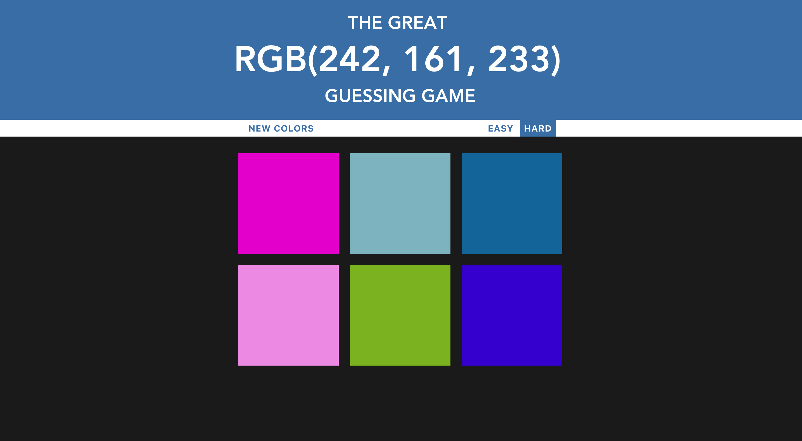
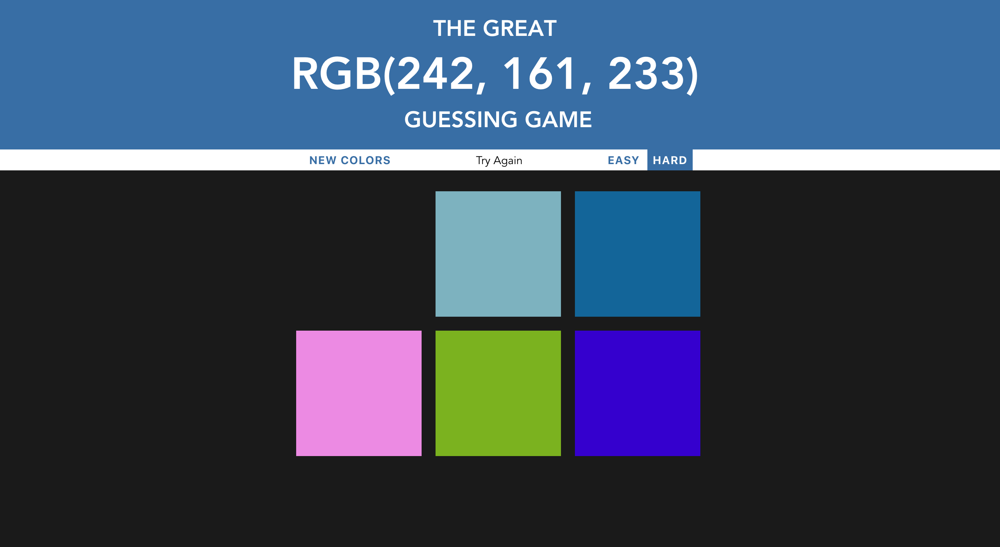
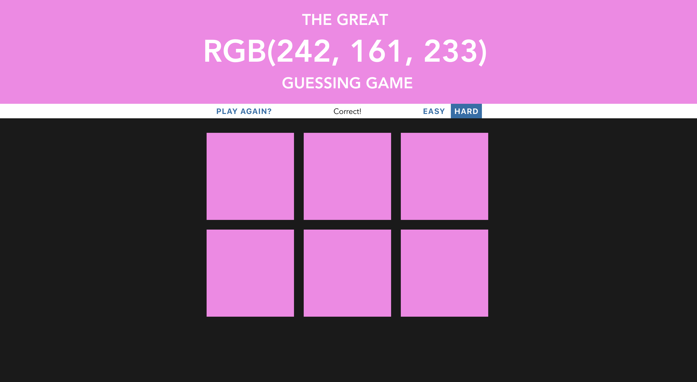

# Web App - Color Guessing Game

Hi, this is my first web app.

It's a color guessing game. 

Players will need to guess the color from the RGB text that's given by choosing the corresponding color of square.

This web app game has two modes, "EASY" and "HARD".

"EASY" mode has three square to guess, and "HARD" has six to start.

When players guess the right color, the heading text will indicate it's correct and the background color and all sqaure turn into the correct corrsponding color.

"Hard" Mode Demonstration

1. Initialize the game

2. Wrong Guess Demonstration (the square fade away) 

3. Correct Guess Output (all turn into the correct color)

