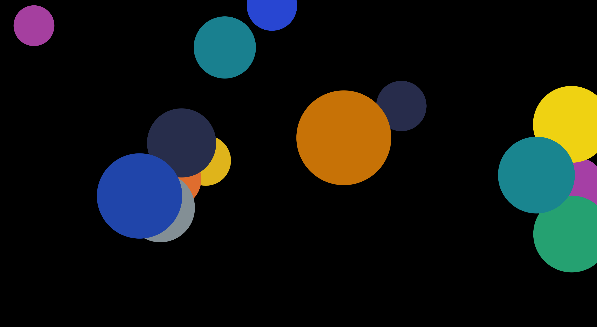

# Interactive_Audio_App

It's a simplified version of Patatap, with only circles that scales down. (https://www.patatap.com/)

When any letter is pressed on keyboard, it will generate a unique color of circle that appears at any random point and provide a special audio sound for only that letter.
Each letter obtains its own color and sound.

